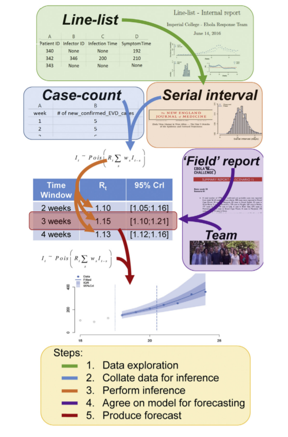

```{r setup, include=FALSE}

knitr::opts_chunk$set(echo = FALSE,
                      tidy.opts=list(width.cutoff=60),
                      tidy=TRUE)
library(tidyverse)
library(lubridate)
library(countrycode)
library(ggrepel)
library(prismatic)
library(ggsci)
library(paletteer)
library(incidence)
library(EpiEstim)
library(projections)
library(epitrix)
library(distcrete)
library(magrittr)
library(readxl)


regions <- read_excel("ON_LineListforMOH_UofT.xlsx")

regions %>% filter(is.na(FSA) | str_detect(FSA, "^1") |str_detect(FSA, "^X")) %>%
  group_by(Diagnosing_Health_Unit_Area_Desc) %>% tally()


regions<-regions %>% mutate(FSA2=if_else(is.na(FSA) | str_detect(FSA, "^1") |str_detect(FSA, "^X"),case_when(
  Diagnosing_Health_Unit_Area_Desc=="BRANT COUNTY (2227)"  ~ "N3S",
  Diagnosing_Health_Unit_Area_Desc=="CHATHAM-KENT (2240)"  ~ "N7W",
  Diagnosing_Health_Unit_Area_Desc=="CITY OF HAMILTON (2237)"  ~ "N3R",
  Diagnosing_Health_Unit_Area_Desc=="CITY OF OTTAWA (2251)"  ~ "K1Y",
  Diagnosing_Health_Unit_Area_Desc=="DURHAM REGION (2230)"  ~ "K9K",
  Diagnosing_Health_Unit_Area_Desc=="EASTERN ONTARIO (2258)"  ~ "K9L",
  Diagnosing_Health_Unit_Area_Desc=="GREY BRUCE (2233)"  ~ "N0K",
  Diagnosing_Health_Unit_Area_Desc=="HALDIMAND-NORFOLK (2234)"  ~ "L8G",
  Diagnosing_Health_Unit_Area_Desc=="HALIBURTON, KAWARTHA, PINE RIDGE (2235)"  ~ "L1H",
  Diagnosing_Health_Unit_Area_Desc=="HALTON REGION (2236)"  ~ "L5E",
  Diagnosing_Health_Unit_Area_Desc=="HASTINGS & PRINCE EDWARD COUNTIES (2238)"  ~ "K7N",
  Diagnosing_Health_Unit_Area_Desc=="KINGSTON, FRONTENAC, LENNOX & ADDINGTON (2241)"  ~ "K7N",
  Diagnosing_Health_Unit_Area_Desc=="LAMBTON COUNTY (2242)"  ~ "N0P",
  Diagnosing_Health_Unit_Area_Desc=="MIDDLESEX-LONDON (2244)"  ~ "N0J",
  Diagnosing_Health_Unit_Area_Desc=="NIAGARA REGION (2246)"  ~ "L8M",
  Diagnosing_Health_Unit_Area_Desc=="OXFORD ELGIN-ST.THOMAS (4913)"  ~ "N0K",
  Diagnosing_Health_Unit_Area_Desc=="PEEL REGION (2253)"  ~ "L5E",
  Diagnosing_Health_Unit_Area_Desc=="PETERBOROUGH COUNTY-CITY (2255)"  ~ "M1R",
  Diagnosing_Health_Unit_Area_Desc=="RENFREW COUNTY AND DISTRICT (2257)"  ~ "K1K",
  Diagnosing_Health_Unit_Area_Desc=="SIMCOE MUSKOKA DISTRICT (2260)"  ~ "P1L",
  Diagnosing_Health_Unit_Area_Desc=="SUDBURY AND DISTRICT (2261)"  ~ "P0L",
  Diagnosing_Health_Unit_Area_Desc=="THUNDER BAY DISTRICT (2262)"  ~ "P0W",
  Diagnosing_Health_Unit_Area_Desc=="TORONTO (3895)"  ~ "M5P",
  Diagnosing_Health_Unit_Area_Desc=="WATERLOO REGION (2265)"  ~ "N2A",
  Diagnosing_Health_Unit_Area_Desc=="WELLINGTON-DUFFERIN-GUELPH (2266)"  ~ "N1M",
  Diagnosing_Health_Unit_Area_Desc=="WINDSOR-ESSEX COUNTY (2268)"  ~ "N0P",
  Diagnosing_Health_Unit_Area_Desc=="YORK REGION (2270)"  ~ "M9M"
),FSA),Accurate_Episode_Date=ymd(Accurate_Episode_Date)
) %>% select(FSA2, Accurate_Episode_Date) %>% rename(FSA=FSA2)


LHIN<- read_excel("LHIN.xlsx")
regions<-LHIN %>%
  mutate(
    health_region = case_when(
      LHIN_NAME=="Erie St. Clair" | LHIN_NAME=="South West" | LHIN_NAME=="Hamilton Niagara Haldimand Brant" | LHIN_NAME=="Waterloo Wellington" ~ "West",
      LHIN_NAME=="Mississauga Halton" | LHIN_NAME=="Central West" | LHIN_NAME=="Central" | LHIN_NAME=="North Simcoe Muskoka" ~ "Central",
      LHIN_NAME=="Toronto Central"  ~ "Toronto",
      LHIN_NAME=="North West" | LHIN_NAME=="North East" ~ "North",
      TRUE                      ~ "East"
    )
  ) %>% select(FSA, health_region) %>% right_join(regions) %>% rename(date=Accurate_Episode_Date) %>% arrange(date) %>%
  group_by(health_region,date) %>% tally(name = "new_confirmed") %>% mutate(iso3c=health_region,data_type="iPHIS",confirmed=cumsum(new_confirmed)) 
regions<-regions[,-1]

ontario<-regions %>% 
  group_by(date) %>%
  summarise_at(vars(-iso3c,-data_type),funs(sum)) %>% mutate(date=ymd(date),iso3c="Ontario",data_type="iPHIS")


plot_project<-function(country="Ontario",conf=20,method=c("Estimate_R","Simulate_R"),
                       pred_days=30,n_sim=1000,mu_R=2.5,sigma_R=0.5,cumul=T) {
  
  df<-regions %>% bind_rows(ontario)  %>% mutate(date=ymd(date)) %>%
    filter(confirmed>=conf,iso3c==country,date<="2020-03-30") %>% 
    rename(I=new_confirmed,dates=date) 
  
  max_cumul<-df %>% summarise(max_cumul=max(confirmed)) %>% select(max_cumul)
  max_cumul<-as.numeric(max_cumul)
  
  incidence_data<- df %>% uncount(I)
  
  incidence_object <- incidence(dates = incidence_data$dates) 
  T <- length(incidence_object$dates)
    t_start <- seq(2, T-1) # starting at 2 as conditional on the past observations
    t_end <- t_start + 1
    config_si=list(mean_si = 7.5, std_mean_si = 2,t_start=t_start,t_end=t_end,
                                      min_mean_si = 1, max_mean_si = 8.4, std_si = 3.4, std_std_si = 1, 
                                      min_std_si = 0.5, max_std_si = 4, n1 = 1000, n2 = 1000)
  param <- gamma_mucv2shapescale(config_si$mean_si, config_si$std_si / config_si$mean_si)
  w <- distcrete("gamma", interval = 1,
                 shape = param$shape,
                 scale = param$scale, w = 0.5)
  date_range <- 1:(length(get_dates(incidence_object)))
  
  if (method == "Estimate_R") {
    re_est<- estimate_R(incidence_object, method = "uncertain_si", 
                        config = make_config(config_si))
    R_sample <- sample_posterior_R(re_est, n = n_sim,window =nrow(re_est$R))
    pred_growth_var <- project(incidence_object[date_range],
                               R = R_sample,R_fix_within = F,
                               si = w,
                               n_days = pred_days, n_sim = 1000)
  } else  {
     R <- rnorm(n_sim, mu_R, sigma_R)
  pred_growth_var <- project(incidence_object[date_range],
                             R = R,R_fix_within = F,
                             si = w,
                             n_days = pred_days, n_sim = n_sim) 
  }

  
  if (cumul ==T) {
    pred_growth_var<-cumulate(pred_growth_var)
    df<-df %>% mutate(I=confirmed)
  }
  
  ### functions
  
  quantile_pal <- grDevices::colorRampPalette(
    c("#b3c6ff", "#d147a3", "#993366"), bias = 2)
  
  color_quantiles <- function(x, palette = quantile_pal) {
    labels <- as.character(unique(x))
    dist_from_median <- 50 - abs(50-as.numeric(sub("%", "", labels)))
    out <- palette(51)[dist_from_median + 1]
    names(out) <- labels
    out
  }
  
  
  
  transp <- function(col, alpha = .5){
    res <- apply(grDevices::col2rgb(col), 2,
                 function(c)
                   grDevices::rgb(c[1]/255, c[2]/255, c[3]/255, alpha))
    return(res)
  }
  
  ###################
  
  dates <- attr(pred_growth_var, "dates")
  stats <- t(apply(pred_growth_var, 1, stats::quantile, c(0.01, .99)))
  if (cumul ==T) {
    stats<-stats+max_cumul
  }
  
  temp <- cbind.data.frame(dates, stats)
  names(temp) <- c("dates", "ymin", "ymax")
  
  
  ribbon_color <- color_quantiles(c(0.01, .99), quantile_pal)[1]
  
  ribbon_color <- transp(ribbon_color, 0.2)
  out<-ggplot()+
    geom_ribbon(
      data = temp,
      aes(x = dates, ymin = ymin, ymax = ymax),
      fill = ribbon_color)+geom_point(aes(x=dates,y=I),data = df,color="darkblue",size=0.9)+geom_line(aes(x=dates,y=I),
                                                                                                      size=.6,data = df,color="darkblue")+
    scale_y_continuous(labels = scales::comma_format(accuracy = 1),trans = "log2",
                       n.breaks = 10)
  stats <- t(apply(pred_growth_var, 1, stats::quantile, c(.01,0.25,.5,.75,.99)))
  if (cumul ==T) {
    stats<-stats+max_cumul
  }
  quantiles <- rep(colnames(stats), each = nrow(stats))
  quantiles <- factor(quantiles, levels = unique(quantiles))
  temp <- cbind.data.frame(dates = rep(dates, ncol(stats)),
                           quantile = quantiles,
                           value = as.vector(stats),
                           stringsAsFactors = FALSE)
  
  
  
  colors <- color_quantiles(temp$quantile, quantile_pal)
  colors <- transp(colors, 1)
  ylab <- ifelse(cumul==T,
                 "Cumulative incidence",
                 "Daily incidence")
  titlab <- ifelse(cumul==T,
                   "Cumulative incidence",
                   "Daily incidence")
  
  out <- suppressMessages(
    out +
      ggplot2::geom_line(
        data = temp,
        aes(x = dates, y = value, color = quantile),
        linetype = 1,
        size = 1
      ) + scale_color_manual(values = colors))+
    labs(title= paste(titlab,"of observed and predicted confirmed cases, ",df$iso3c),
         x = "Date", color="Quantile",
         y = paste(ylab,"(log2 scale)"),
         subtitle = paste("Data as of", format(max(ontario$date), "%A, %B %e, %Y")))+
    scale_x_date(date_breaks = "1 week")+
    theme(axis.text.x = element_text(angle = 45, hjust = 1, size = rel(2)),plot.title = element_text(size = rel(2), face = "bold"),
          plot.subtitle = element_text(size = rel(1.5)),
          axis.text.y = element_text(size = rel(2)),
          axis.title.x = element_text(size = rel(1.5)),
          axis.title.y = element_text(size = rel(1.5)),
          panel.grid.major = element_line(colour = "grey90", size = .1),
          panel.background = element_blank(),
          axis.line = element_line(colour = "grey50", size = .9))
  return<-list(re_est=re_est,out=out,temp=temp)
  return(return)
}

plot_Ri <- function(estimate_R_obj) {
  p_I <- plot(estimate_R_obj, "incid") # plots the incidence
  p_SI <- plot(estimate_R_obj, "SI") # plots the serial interval distribution
  p_Ri <- plot(estimate_R_obj, "R")
  return(gridExtra::grid.arrange(p_I, p_SI, p_Ri, ncol = 1))
}

result<-plot_project(method = "Estimate_R",cumul = F)
central<-plot_project(country = "Central",method = "Estimate_R",cumul = F)
east<-plot_project(country = "East",method = "Estimate_R",cumul = F)
north<-plot_project(country = "North",method = "Estimate_R",cumul = F)
toronto<-plot_project(country = "Toronto",method = "Estimate_R",cumul = F)
west<-plot_project(country = "West",method = "Estimate_R",cumul = F)
```

# Modelling the COVID-19 epidemic 

## Data

In order to make this analysis to be reproducible and avoid manual abstracting, this tool will use [collated COVID-19 data](https://github.com/CSSEGISandData/COVID-19), maintained by Johns Hopkins University Center for Systems Science and Engineering (JHU CCSE) and used as the source for [the dashboard](https://www.arcgis.com/apps/opsdashboard/index.html#/bda7594740fd40299423467b48e9ecf6) which they provide. For the purpose of this report, our analysis is based only on observed data up to `r format(max(ontario$date), "%d %B %Y")`.

# Projections

## General idea

Our projections will rely on a well-established and simple method that assumed the daily incidence, $I_t$, could be approximated with a Poisson process following the renewal equation (Fraser, 2007):

$$I_t \sim Pois(R_t\sum_{s=1}^{t} I_{t-s} \omega_s)$$ 

where $R_t$ is the instantaneous reproduction number and $\omega$ the serial interval (SI) distribution.^[time between onsets of infectors and infectees] From this a likelihood of the data given a set of model parameters can be calculated, as well the posterior distribution of $R_t$ given previous observations of incidence and knowledge of the serial interval (Cori et al., 2013).

The next figure shows how the forecast for future projections work. This figure was taken from [Nouvellet _et al._](https://europepmc.org/article/med/28351674).

```{r pressure, echo=FALSE, fig.cap="Forecast algorithm",fig.align="center"}

```

Therefore our work relies on simulating trajectories where daily incidence follows a Poisson process determined by a daily infectiousness.

## Estimation of reproduction number

Given the above, it would be useful to estimate the current _instantaneous reproduction number_ $R_{t}$ on a day-by-day basis so as to track the effectiveness of public health interventions.
In fact, there are several available methods for estimating $R_{t}$ -- exploring all of those is beyond the scope of this tool.

Instead, we will focus on one method, developed in 2013 by Anne Cori and colleagues at Imperial College, London, which permits estimation of the _instantaneous reproduction number_, which is exactly want we want in order to track the effectiveness of containment efforts. This method estimates the _instantaneous reproduction number_ for an epidemic over predefined time windows using a Bayesian framework, for a given discrete distribution of the serial interval. Full details are available in the [original paper](https://www.ncbi.nlm.nih.gov/pmc/articles/PMC3816335/) on the method, with extensions described in a later paper by [Thompson _et al._](https://doi.org/10.1016/j.epidem.2019.100356). We used the `EpiEstim` package for _R_, which implements this method. In genereal there are 2 ways to get the serial interval distribution (usually it is assumed that it follows a gamma distribution:

1. Serial interval distribution is directly estimated.
2. The user specifies the mean and sd of the serial interval. We can be as "Bayesian" as we want meaning that we can sample this 2 parameters (mean and sd).

Using Ontario daily incidence data, let's take a look of the _instantaneous reproduction number_ over time. We used one published estimate of the _serial interval_ distribution, derived from analysis of just 5 primary cases amongst the first 450 cases in Wuhan, published by [Li _et al._](https://www.nejm.org/doi/full/10.1056/NEJMoa2001316). They estimate the serial interval distribution to have a mean of 7.5 days with a standard deviation of 3.4 days. Recently another estimate was published where the mean estimate of the serial interval distribution was 3.96  days [Du _et al._](https://wwwnc.cdc.gov/eid/article/26/6/20-0357_article).

```{r Cori_uncertain_si_model, echo=F, message=FALSE, warning=FALSE,fig.height=10,fig.cap="Daily incidence, SI distribution an Estimated R for ON",fig.width=12}
plot_Ri(result$re_est)
```


## Projecting incidence for COVID-19

Here we'll examine the use of the [`projections` package](https://www.repidemicsconsortium.org/projections/). This package is part of the excellent [**R** **E**pidemics **Con**sortium (**RECON**) suite](https://www.repidemicsconsortium.org) which includes libraries for epidemic modelling and control (`EpiEstim` is also part of this). We show projections for Ontario and its health regions for the next 14 days.

```{r projections, echo=F, message=FALSE, warning=FALSE,fig.height=10,fig.width=12}
result$out
```

```{r projections2, echo=F, message=FALSE, warning=FALSE,fig.height=10,fig.width=12}
central$out
```

```{r projections3, echo=F, message=FALSE, warning=FALSE,fig.height=10,fig.width=12}
east$out
```

```{r projections4, echo=F, message=FALSE, warning=FALSE,fig.height=10,fig.width=12}
west$out
```

```{r projections5, echo=F, message=FALSE, warning=FALSE,fig.height=10,fig.width=12}
north$out
```

```{r projections6, echo=F, message=FALSE, warning=FALSE,fig.height=10,fig.width=12}
toronto$out
```